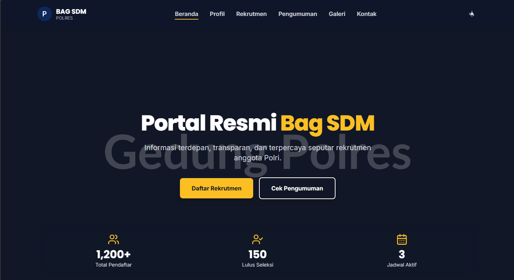
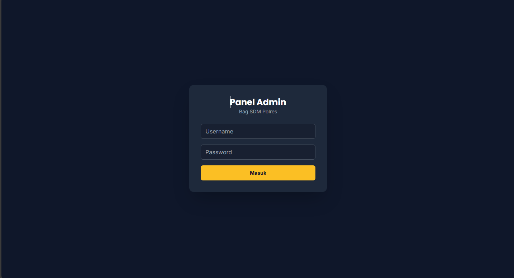
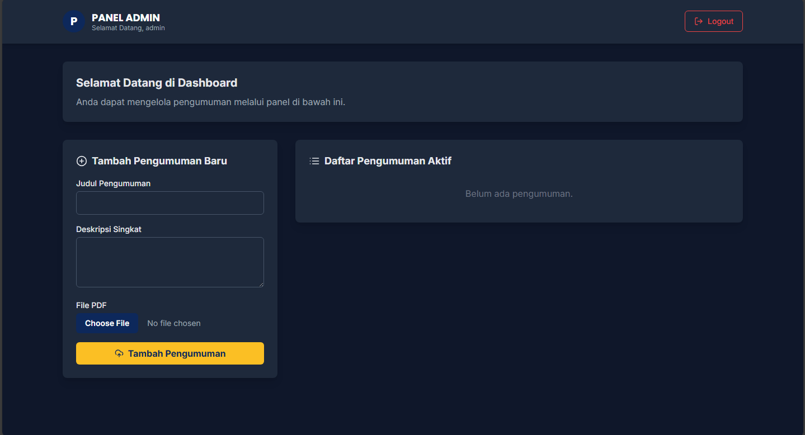

# 🛡️ Template Website POLRI - SDM

Template website sederhana bertemakan SDM POLRI Ini Hanya untuk PEMBELAJARAN/NON-RESMI. Cocok digunakan sebagai portal informasi internal dengan fitur upload pengumuman melalui dashboard admin.

---

---

## 🖼️ Cuplikan Layar

### 🏠 Halaman Beranda


### 🔐 Halaman Login Admin


### 📋 Dashboard Admin - Kelola Pengumuman


---

## 🚀 Fitur Utama

- 🌐 Tampilan website informatif dan sederhana
- 🔐 Login dashboard admin (username & password bisa diubah)
- 📢 Upload pengumuman langsung dari dashboard
- ⚙️ Mudah diinstal dan dijalankan secara lokal

---

## ⚙️ Cara Instalasi

1. Pastikan **Node.js** sudah terinstall di perangkat kamu.  
   Unduh di sini: [https://nodejs.org](https://nodejs.org)

2. Clone atau download repositori ini.

3. Buka terminal, lalu masuk ke direktori project:

   ```
   cd template-website-polri-SDM
  ```
  npm install
  ```
   ```
  node .
  ```
🔐 Login Dashboard Admin
```
Username: admin
```
```
Password: admin123
```
Untuk mengganti username dan password, buka file server.js.

📌 Catatan
Template ini masih dalam tahap pengembangan.
Silakan modifikasi sesuai kebutuhan dan beri feedback jika ada saran.
Terima kasih! 🙏

"DISCLAIMER: Ini adalah template web bertema SDM Polri untuk keperluan edukasi/non-resmi. Bukan situs resmi Polri."

## 📝 Lisensi

Proyek ini dilisensikan di bawah [GNU General Public License v3.0 (GPL-3.0)](https://www.gnu.org/licenses/gpl-3.0.html).

Dengan lisensi ini, Anda bebas menggunakan, memodifikasi, dan mendistribusikan ulang kode sumber ini.  
Namun, setiap distribusi (baik original maupun modifikasi) **wajib** menyertakan kode sumber dan tetap menggunakan lisensi yang sama.


